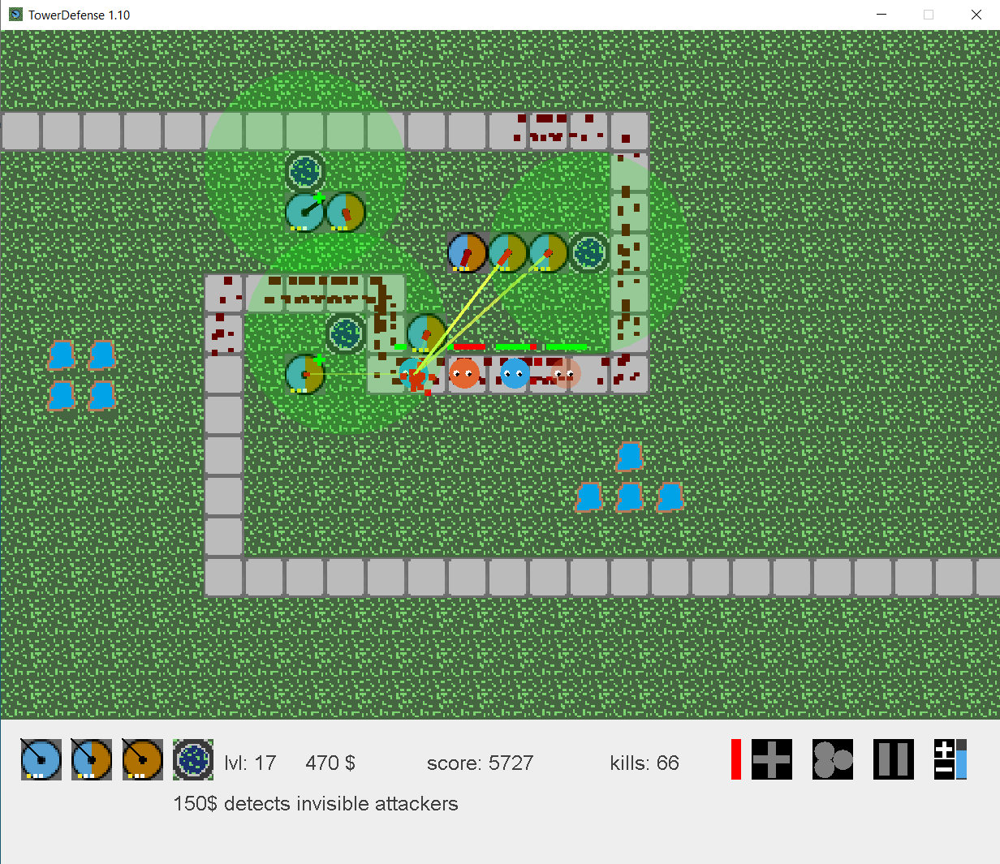

# JTowerDefense

It's a simple Java Tower Defense game. There are four types of towers that can be build:
<table>
<tr>
<td></td>
<td>Attacks blue enemies.</td>
</tr>
<tr>
<td></td>
<td>Can attack both kinds of enemies</td>
</tr>
<tr>
<td></td>
<td>Attacks brown enemies</td>
</tr>
<tr>
<td></td>
<td>Makes invisible attackers visible for defending towers</td>
</tr>
</table>

# Old Changelog

27.03.2023 Major refactoring started

26.03.2023 Highscore removed

21.04.2013 Blood effects adjustable

21.04.2013 Highscore fixed!

19.04.2013 max and min speed adjusted

19.04.2013 Maximum upgrade level visible on tower

15.04.2013 Keyboard shortcut introduced

15.04.2013 Message if highscore could not be transmitted.

15.04.2013 Adjustment to count up score

15.04.2013 Highscore transmission UTF-8 coded

11.04.2013 Transmission of highscore introduced

08.04.2013 Detector Tower introduced

08.04.2013 Performance improvement when drawing the background
